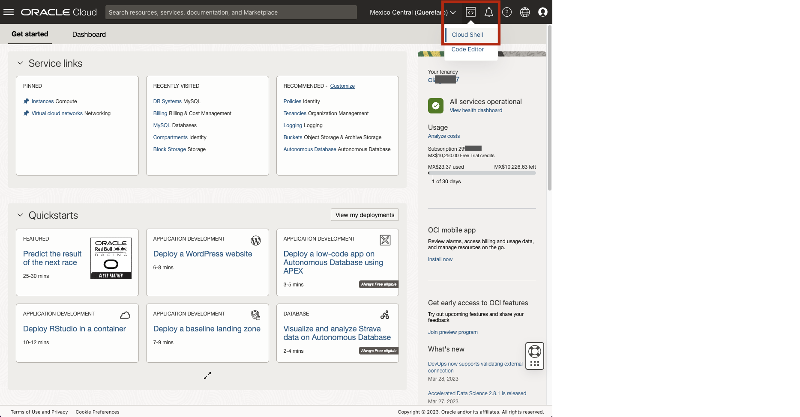

# Crea una conexión a HeatWave por SSH y MySQLShell y restaura una base de datos TPCH


## Introducción

Al trabajar en la nube, a menudo hay ocasiones en las que sus servidores y servicios no están expuestos a la red pública de Internet. Oracle Cloud Infrastructure (OCI) MySQL HeatWave es un ejemplo de un servicio al que solo se puede acceder a través de redes privadas. Dado que el servicio está totalmente gestionado, lo mantenemos aislado de Internet para ayudar a proteger sus datos de posibles ataques y vulnerabilidades. Es una buena práctica limitar la exposición a los recursos tanto como sea posible, pero en algún momento, es probable que desee conectarse a esos recursos. Ahí es donde entra en escena el acceso privado de Cloud Shell. El acceso privado de Cloud Shell permite conectar una sesión de Cloud Shell a una red privada para que pueda acceder a la base de datos de MySQL HeatWave sin tener el flujo de tráfico de red a través de redes públicas

_Tiempo estimado:_ 10 minutes

### Objectivos

En este laboratorio, se le guiará por las siguientes tareas:

- Conectar a Cloud Shell
- Configurar acceso privado de Cloud Shell
- Utilice MySQLShell para conectarse a la base de datos de Heatwave

### Prerequisites

- Una cuenta de prueba o de pago de Oracle Cloud Infraestructure 
- Laboratorio 1 completado

## Tarea 1: Accede a Cloud Shell desde la Consola de OCI 

1. Ingresa a la consola de OCI
2. Haga clic en el icono de Cloud Shell en la cabecera de la consola. 

    

    Se mostrará la termnal de Cloud Shell en la parte baja de la pantalla
    

    Puede utilizar los iconos de la esquina superior derecha de la ventana de Cloud Shell para minimizar, maximizar, reiniciar y cerrar la sesión de Cloud Shell.

## Tarea 2: Ingrese a la Instancia de Cómputo utilizando SSH 
1. Abra la llave privada ssh y copie su contenido
    

2. Abra un editor de texto desde OCI Cloud Shell

    ```bash
    <copy>nano id_rsa</copy>
    ```

3. Dentro del editor, pegue el contenido de la llave privada ssh
    

4. Cambie los permisos de la llave privada ssh
    ```bash
    <copy>sudo chmod 400 id_rsa</copy>
    ```

5. Cree una conexión a HEATWAVE-Compute por SSH

    Asegurese de agregar al final del comando, la IP de HEATWAVE-Compute
    ```bash
    <copy>ssh -i id_rsa opc@<IP> </copy>
    ```
    _Por ejemplo_: ssh -i id_rsa opc@192.34.1.10

    

## Tarea 3: Descargue MySQL Shell 
1. Instale MySQL Shell, ejecute:
    ```bash
    <copy>sudo install -y mysql-shell</copy>
    ```
    

2. Cree una conexión al DBSystem con mysqlshell

    Asegurese de reemplazar la IP con la IP del DBSystem

    ```bash
    <copy>mysqlsh admin@<IP> </copy>
    ```
     _Por ejemplo_: mysqlsh admin@10.0.1.202
    
    
3. Ingresa la contraseña
    ```bash
    <copy>Welcome!</copy>
    ```
    

4. Escriba 'Y', para asegurar que MySQL Shell guarde la contraseña del usuario admin.
    

## Tarea 4: Restaure la data de ejemplo TPCH

 To install the airportdb database:  **Connect to MySQL Database Service**

1. From your cloud shell, connect to HEATWAVE-DB  using the MySQL Shell client tool.

   The endpoint (IP Address) can be found in your notepad or  the HEATWAVE-DB  System Details page, under the "Endpoint" "Private IP Address". 

    

2. Use the following command to connect to MySQL using the MySQL Shell client tool. Be sure to add the MDS-HW private IP address at the end of the command. Also enter the admin user and the db password created on Lab 1

    (Example  **mysqlsh -uadmin -p -h10.0.1..**)

    **[opc@...]$**

    ```bash
    <copy>mysqlsh -uadmin -p -h 10.0.1... </copy>
    ```

    

3. Load the airportdb database into the MySQL DB System using the MySQL Shell Dump Loading Utility.

    ```bash
    <copy>\js</copy>
    ```

    ```bash
    <copy>util.loadDump("https://objectstorage.us-ashburn-1.oraclecloud.com/p/yXOA3Kwid4uG0oHvHMufbK3cSESmQlU6-0bVB_1vQ8VxR0ggB1m-nDYYOXXy0O5W/n/idazzjlcjqzj/b/airportdb-bucket-112312031/o/airportdb_all/", {progressFile: "progress.json", loadIndexes:false})</copy>
    ```

    

4. View  the airportdb total records per table

    ```bash
    <copy>\sql</copy>
    ```

    ```bash
    <copy>SELECT table_name, table_rows FROM INFORMATION_SCHEMA.TABLES WHERE TABLE_SCHEMA = 'airportdb';</copy>
    ```

     

5. Exit MySQL Shell

      ```bash
      <copy>\q</copy>
      ```

You may now **proceed to the next lab**

## Acknowledgements

- **Author** - Perside Foster, MySQL Principal Solution Engineering
- **Contributors** - Mandy Pang, MySQL Principal Product Manager,  Nick Mader, MySQL Global Channel Enablement & Strategy Manager
- **Last Updated By/Date** - Perside Foster, MySQL Solution Engineering, July 2023