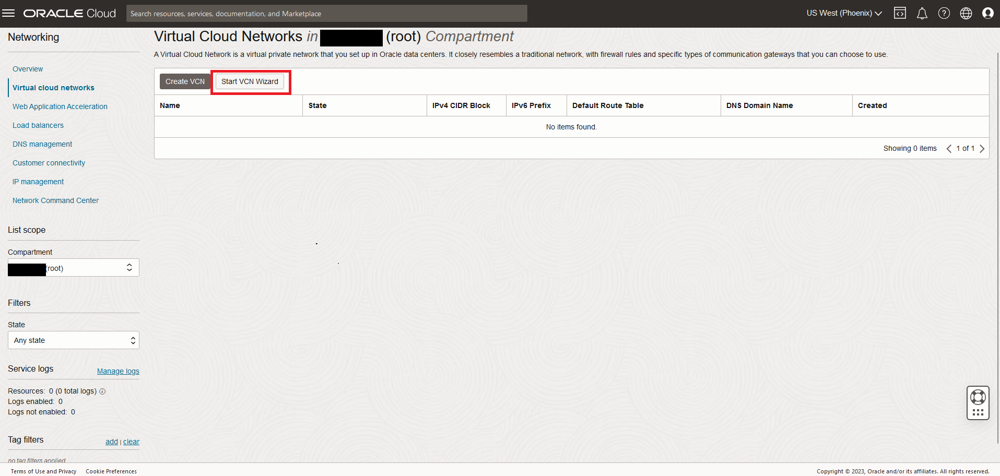
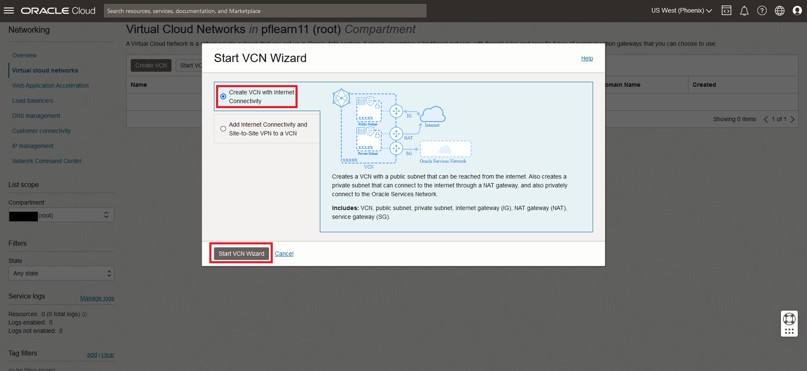
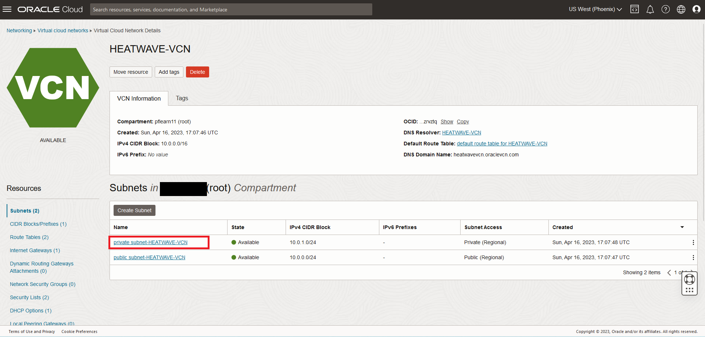
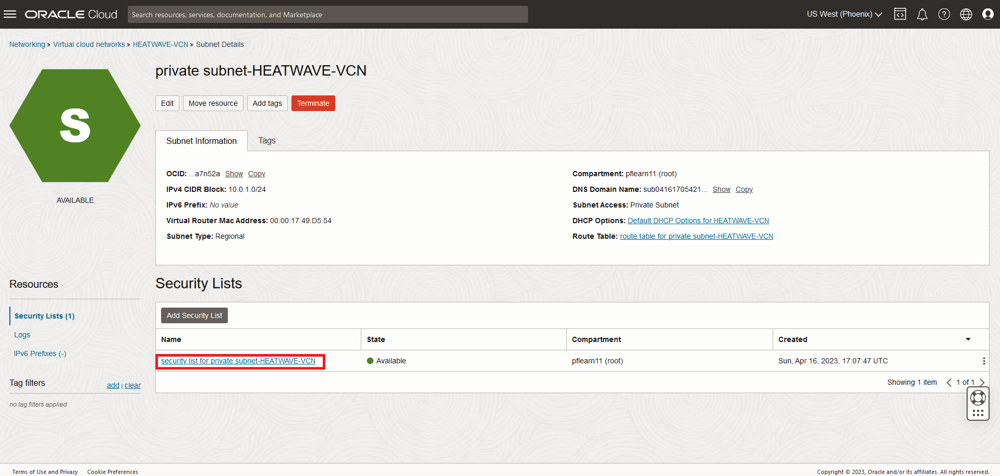
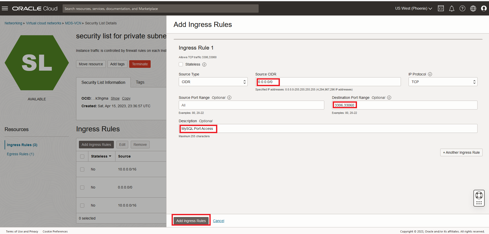
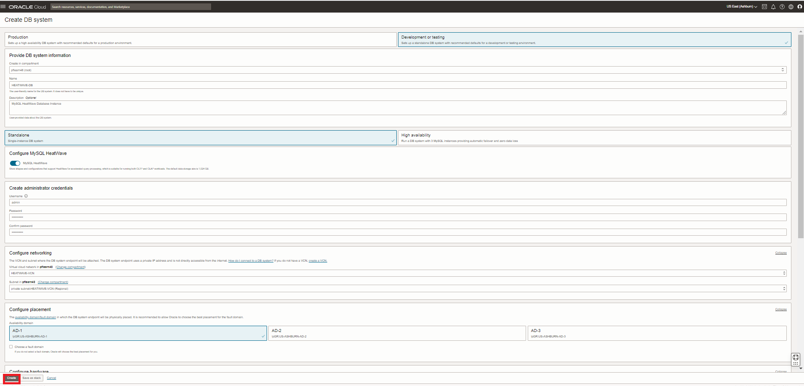
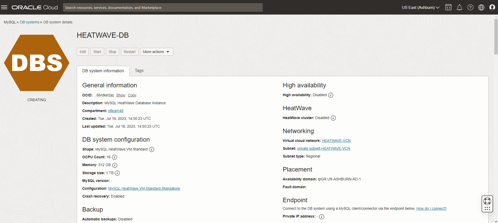

# Crea una Instancia de Cómputo y un DBSystem HeatWave


## Introducción

En este laboratorio, crearás y configurarás un DB System HeatWave.


_Tiempo estimado:_ 15 minutos

### Objetivos

En este laboratorio, serás guiado a través de las siguientes tareas:

- Creación de una Virtual Cloud Network (VCN)
- Creación de una instancia de HeatWave (DB System)

### Prerequisitos

- Una cuenta de prueba o de pago de Oracle Cloud Infraestructure

## Tarea 1: Creación de Virtual Cloud Network (VCN)

1. Debe conectarse a su cuenta de Oracle Cloud Infraestructure

    Haga Click en el **Menu Principal**,

    

2. Haga click en **Networking**, después en **Virtual Cloud Networks**  
    

    Selecciona el compartment root o raíz
    

3. Haga click en **Start VCN Wizard**
    

4. Seleccione 'Create VCN with Internet Connectivity'

    Haga click en 'Start VCN Wizard'
    

5. Creación de una VCN con conexión a Internet

    Complete los siguientes campos:

    Nombre de la VCN:

    ```bash
    <copy>HEATWAVE-VCN</copy>
    ```

    Compartimento: Seleccione  **root**

    Su pantalla debe verse de la siguente forma:
    

6. Haga click en 'Next' en la parte baja de la pantalla

7. Revisión de la VCN, subredes y gateways 

    Haga click en 'Create' para crear una VCN
    

8. Cuando la creación de la VCN se complete, haga click en View 'Virtual Cloud Network' para acceder a la VCN recién creada
    

## Tarea 2: Configure listas de seguridad para permitir conexiónes hacia MySQL

1. En la página de HEATWAVE-VCN, debajo de 'Subnets in root Compartment', haga click en'**Private Subnet-HEATWAVE-VCN**'
     

2. Haga click en '**Security List for Private Subnet-HEATWAVE-VCN**'
    

3. En la sección de 'Ingress Rules', haga click en '**Add Ingress Rules**'
    

4. En la nueva pantalla, complete los campos:

    a. Agregue una Regla de entrada con el CIDR de origen

    ```bash
    <copy>0.0.0.0/0</copy>
    ```

    b. Rango de puertos de destino

    ```bash
    <copy>3306,33060</copy>
     ```

    c. Descripción

    ```bash
    <copy>Puerto de Acceso MySQL</copy>
    ```

    d. Haga click en 'Add Ingress Rule'
    

5. En la lista de seguridad de la página Subred privada-HEATWAVE-VCN, las nuevas reglas de entrada se mostrarán en la lista Reglas de entrada
    

## Tarea 3: Configure la lista de seguridad para permitir conexiónes HTTP

1. Haga click en el Menu Principal > Networking > Virtual Cloud Networks

2. Seleccione HEATWAVE-VCN

3. Haga click en subnet-HEATWAVE-VCN

4. Haga click en 'Default Security List for HEATWAVE-VCN'

5. Haga click en 'Add Ingress Rules' 

    Agregue una Regla de entrada con el CIDR de origen:

    ```bash
    <copy>0.0.0.0/0</copy>
    ```

    Rango de puertos de destino:

    ```bash
    <copy>80,443</copy>
    ```

    Descripción:

    ```bash
    <copy>Allow HTTP connections</copy>
    ```

6. Haga click 'Add Ingress Rule'

    

7. En la lista de seguridad, las nuevas reglas de entrada se mostrarán en la lista de reglas de entrada

    

## Tarea 4: Crea una instancia de HeatWave (DBSystem)

1. Haga click en el Menu Principal > Databases > DBSystems
    

2. Haga click en 'Create DB System'
    

3. Complete los campos en cada sección

    - Información del DB System 
    - Configuración del DB system
    - Cree las credenciales de administrador
    - Configure la red
    - Configure el placement
    - Configure el hardware
    - Configure los Backups
    - Configure opciones avanzadas
4. Seleccione **Development or Testing**

    

5. Provea información básica para el DB System:

    a. Seleccione el comaprtimento **root**

    b. Ingrese el nombre

    ```bash
    <copy>HEATWAVE-DB</copy>
    ```

    c. Ingrese una descripción (opcional)

    ```bash
    <copy>MySQL HeatWave Database Instance</copy>
    ```

    d. Seleccione **Standalone** 
    

6. Cree las credenciales de adminstrador

    Ingrese el usuario **Username** 

    ```bash
    <copy>admin</copy>
    ```

    Ingrese una contraseña **Enter Password** 

    ```bash
    <copy>Welcome1!</copy>
    ```

    Confrme la contraseña **Confirm Password**
    
    ```bash
    <copy>Welcome1!</copy>
    ``` 

    

7. En la confguración de red, mantenga los valores por defecto

    a. Virtual Cloud Network: **HEATWAVE-VCN**

    b. Subnet: **Private Subnet-HEATWAVE-VCN (Regional)**

    c. En 'Configure placement', no habilte la opción 'Choose a Fault Domain' 

    

8. Configuración de hardware
    - a. Haga click en el botón de **Change shape** y seleccione el shape **MySQL.32**.
    - b. Para el tamaño de almacenamiento (GB) configure el valor a **1024**

    

9. En la configuración de backups, deshabilite la opción de 'Enable Automatic Backup'

    

10. Haga click en 'Show Advanced Options'

11. De cliick en la pestaña de 'Networking', en el campo 'Hostname' ingrese: 

    ```bash
        <copy>HEATWAVE-DB</copy> 
    ```  

    

12. Verifique la página **Create MySQL DB System**  

    
  

    Haga click en el botón '**Create**'

13. El nuevo DBSystem estará listo para utilizarse después de algunos minutos.

    El estado de la instancia se mostrará 'Creating' durante la creación
    

14. Una vez que el estado cambie a 'Active' el DBSystem estará listo para su uso 

    En la página del DBSystem HEATWAVE-HW, haga click en la pestaña 'Connections'(Private IP Address)

    

15. Identifique la IP privada de su DBSystem, la ocupará en el siguiente laboratorio

    

## Tarea 5: Crea una instancia de cómputo 

1. Haga click en el Menu Principal > Compute > Instances
    

2. Seleccione el compartimento **root**
    

3. Haga click en 'Create Instance' 
    

4. Asigne un nombre a la instancia de cómputo:
    ```bash
    <copy>HEATWAVE-Compute</copy>
    ```
    

5. Verifique la configuración de Red
    

6. Descargue las llaves SSH (privada y pública) y haga click en 'Create'
    

7. Una vez que la instancia cambie a estado 'Active', estará lista para su uso. 
    
    Identifique la IP pública de la instancia, la ocupará en el siguiente laboratorio
    


You may now **proceed to the next lab**

## Créditos

- **Autor(es)** - Perside Foster, MySQL Principal Solution Engineering; Selena Sánchez, MySQL Solution Engineering
- **Colaboradores** - 
- **Última actualización** - Selena Sánchez, MySQL Solution Engineering, Agosto 2024